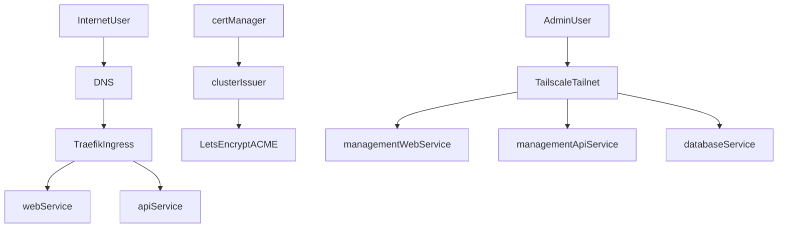

# Boilerplate K3s Deployment Foundation

## Decisions Locked

- Primary target: single-node `k3s` on one VM.
- Install path v1: DigitalOcean Droplet + cloud-init bootstrap.
- Exposure model: public `web` + `api`; VPN-only `management-web`, `management-api`, and databases.
- TLS model: mirror Podverse k3s pattern (Traefik ingress + cert-manager `ClusterIssuer`) with a smaller initial footprint.

## Existing References To Reuse

- Boilerplate infra baseline (no k8s yet): [infra/INFRA.md](/Users/mitcheldowney/repos/pv/boilerplate/infra/INFRA.md)
- Podverse ingress + cert-manager annotation pattern: [infra/k8s/base/common/ingress.yaml](/Users/mitcheldowney/repos/pv/podverse/infra/k8s/base/common/ingress.yaml)
- Podverse k3s architecture/ops flow: [infra/k8s/K8S.md](/Users/mitcheldowney/repos/pv/podverse/infra/k8s/K8S.md)
- Existing Tailscale service exposure model: [infra/k8s/alpha/db/tailscale-patch.yaml](/Users/mitcheldowney/repos/pv/podverse/infra/k8s/alpha/db/tailscale-patch.yaml)

## Target Architecture (v1)

## Implementation Phases

1. `k3s base`: provision single-node k3s, install Traefik defaults, namespace layout, storage classes.
2. `security baseline`: install cert-manager + `ClusterIssuer` (DNS-01 preferred), create sealed secret workflow for DNS token + app secrets.
3. `network exposure`: create ingress for public apps (`web`, `api`), configure Tailscale Operator and mark internal services as Tailscale `LoadBalancer` only.
4. `workload packaging`: add Boilerplate k8s manifests/overlays (`web`, `api`, `management-web`, `management-api`, `db`, `valkey`) using a clean base+env overlay structure.
5. `operations`: add health checks, backup/restore docs, upgrade notes, and rollback guidance.

## Acceptance Criteria

- Public domains serve `web` and `api` over trusted TLS certificates.
- `management-web` and `management-api` are unreachable from public internet and reachable via tailnet.
- Databases are not exposed publicly.
- Fresh install can be completed from a documented, deterministic sequence.
- A new team member can run the setup with only documented inputs (domain, tokens, secrets).
