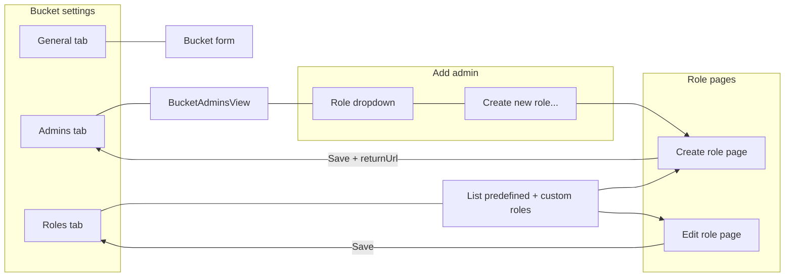

# Flow diagram and default roles reference

## Flow (mermaid)

## Default predefined roles (recommendation)

| Role id   | i18n key      | bucket_crud | message_crud | admin_crud |
|-----------|---------------|-------------|--------------|------------|
| full      | roles.full    | 15          | 15           | 15         |
| no_update | roles.noUpdate| 11          | 11           | 11         |
| no_delete | roles.noDelete| 7           | 7            | 7          |
| read_only | roles.readOnly| 2           | 2            | 2          |

CRUD: create=1, read=2, update=4, delete=8. Full=15; no_update=11 (create+read+delete);
no_delete=7 (create+read+update); read_only=2.
