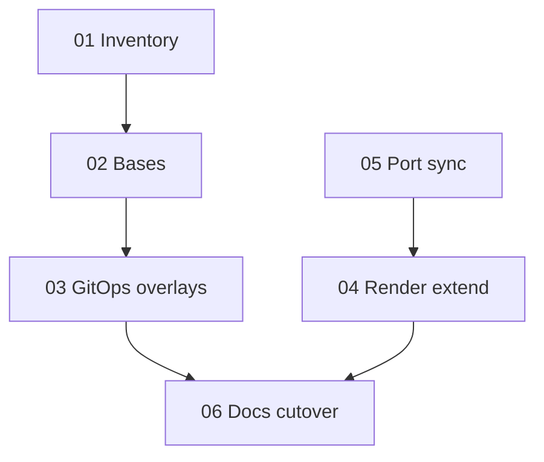

# Summary — boilerplate-k8s-gitops-alignment

## Scope

Align Boilerplate **remote** Kubernetes with **Podverse-style** per-component Kustomize bases
in the **Boilerplate** monorepo, keep **GitOps** state in **k.podcastdj.com** as thin overlays,
deepen use of **classification** + `make alpha_env_render`, and add **deterministic port**
tooling so ports are not duplicated inconsistently across Deployments, Services, Ingress, and
probes.

## GitOps repo vs public domains

**Repository:** Boilerplate alpha manifests and Argo paths continue to live under the
**k.podcastdj.com** GitOps repo (e.g. `apps/boilerplate-alpha/`, `argocd/boilerplate-alpha/`).

**User-facing hosts:** The stack is intended to run on the **same Kubernetes cluster / server**
as other workloads tracked by that repo, but **HTTP(S) traffic** for Boilerplate alpha uses
**metaboost.cc** alpha-style hostnames (not podcastdj.com). Therefore:

- **Ingress** `spec.rules[].host`, **TLS** `secretName` / cert alignment, and **DNS** must target
  metaboost.cc (or the exact alpha subdomain pattern you use there).
- **Rendered config** from classification (`make alpha_env_render`) and
  `dev/env-overrides/alpha/*.env` must use those same hosts for CORS, cookie domain, public
  base URLs, management URLs, and any `NEXT_PUBLIC_*` or sidecar `RUNTIME_CONFIG_URL` patterns
  so browsers and APIs agree.

The **namespace** may remain `boilerplate-alpha`; only the **external identity** is
metaboost.cc. Document concrete hostnames in inventory (plan **01**) and REMOTE-K8S-GITOPS when
implementing plan **06**.

## Plan files

| File                                                           | Topic                          |
| -------------------------------------------------------------- | ------------------------------ |
| [00-EXECUTION-ORDER.md](00-EXECUTION-ORDER.md)                 | Phase order and verification   |
| [01-inventory-and-target-layout.md](01-inventory-and-target-layout.md) | Current vs target mapping |
| [02-boilerplate-base-kustomize.md](02-boilerplate-base-kustomize.md)     | Bases in Boilerplate      |
| [03-kpodcastdj-thin-overlays.md](03-kpodcastdj-thin-overlays.md)         | k.podcastdj.com overlays  |
| [04-classification-render-and-owned-files.md](04-classification-render-and-owned-files.md) | Render / drift |
| [05-port-sync-deterministic.md](05-port-sync-deterministic.md)           | Port contract + scripts   |
| [06-docs-cutover-staging.md](06-docs-cutover-staging.md)               | Docs + cluster cutover    |
| [COPY-PASTA.md](COPY-PASTA.md)                                           | Agent prompts             |

## Dependency map

## Risks and mitigations

- **Private Boilerplate repo:** Argo CD must have credentials for the repo hosting
  `infra/k8s/base/*`; document fork URL and `ref` (branch/tag) in REMOTE-K8S-GITOPS.
- **Kustomize remote modules:** Require `kubectl kustomize` / Argo with
  `--load-restrictor LoadRestrictionsNone` when using `github.com/...` resource URLs (match
  Podverse).
- **Generator vs hand edits:** Only listed paths in `k8s-env-render-manifest.inc.sh` (and any
  new manifest) should be pruned/generated; avoid mixing hand edits into generated port patches.
- **Downtime:** Cutover should prefer tag pinned bases and ordered sync (`common` before
  workloads).
- **Domain mismatch:** If ingress uses **metaboost.cc** but rendered CORS/cookies still point
  elsewhere, browsers will fail auth or API calls; keep inventory + validate after each render.

## Decisions log

| Date       | Decision | Owner |
| ---------- | -------- | ----- |
| 2026-03-27 | Local k3d **Option B**: defer `local/stack` until **02–03** stabilize; then **Option A** | Agent |
| 2026-03-27 | Remote bases in `infra/k8s/base/*`; GitOps URL uses org/repo + `ref` you push | Agent |
| 2026-03-27 | Port patches: **strategic merge** YAML from `render_remote_k8s_ports.rb` (drift-friendly) | Agent |
| 2026-03-27 | GitOps in k.podcastdj.com; **public domains = metaboost.cc** (alpha) on same cluster | Developer |
| 2026-03-27 | **Phase 6:** Canonical Argo `Application` CRs in GitOps repo only; removed `infra/k8s/alpha-application.yaml`; staging cutover as operator checklist doc | Agent |

_Update this table as phases complete._
